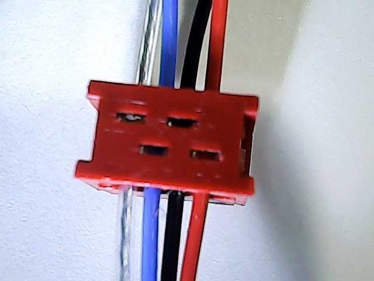

# 简单机器人总线SRB协议V0.1.1
`李阳` `lee8871@126.com`
## 什么是SRB
Simple Robotic Bus 简单机器人总线。</br>
### 阅读指南
本文适合想要了解SRB总线协议的人员阅读。本文中第一节介绍了SRB总线的特点和用途。后续各节规定了SRB总线的协议细节。**本文作者建议，想要使用SRB设备的人员只需要阅读本文第一节，而想要开发SRB设备或者希望对总线有更深了解的人，可以参照本文的后续章节进行工作。**</br>
### 关于总线
SRB是一种主从式总线协议，一台主机连接了多个SRB节点，主机通过总线通信，访问节点。
每次访问都将数据写入节点，并读取从机采集到的数据。</br>
### 关于机器人
SRB是专门为了机器人场合使用的总线协议，特别说明，这里的机器人更倾向于非工业机器人，例如服务机器人。
这些机器人工作在非结构化环境<sup>1</sup>，需要大量的传感器来检测环境。
SRB让机器人能够连接大量传感器，且接线方便，可以在设计过程中随意调整传感器的数量和位置。</br>
</br>
（图1 本图中，机械手的SRB和底盘的SRB连在一起，就可以完成机械手和底盘的组合。）</br></br>
SRB工作波特率为2Mb/s，实际控制时，控制周期可以达到1kHz~100Hz，具体依节点的数量而定。</br>
### 关于简单
#### 易用
SRB设备的硬件安装非常容易。SRB总线使用四芯排线作为通信和逻辑供电<sup>2</sup>，使用IDC接头连接设备，可以在排线的任意位置引出一个接头接上SRB设备。一条排线可以连接任意多个SRB设备。下图是SRB总线和IDC接头的照片。</br>
</br>
（图2 本图中，左为IDC端子器件,右为接入排线的IDC端子,中间为拆掉端子后的排线）</br></br>
**这样的设计让SRB的使用者可以非常方便的改变机器人硬件**，包括添加或删除传感器，改变机器人结构，甚至将机械臂并入一个机器人底盘。
进行这样的操作不需要编写任何微控制器程序和软件驱动，只需要进行两布步工作：</br>
1.  将新的SRB设备连接到电脑，使用配置软件修改节点地址。
2.  在排线上压入新的IDC接头，将SRB设备接入。或者将要接入的设备与原有设备的SRB连在一起。</br>
#### 易学
SRB遵守**实现一种功能有且最好仅有一种方法**的设计理念。
事实上，使用SRB将功能全部压缩到了**数据传输**和**配置传输**两种访问模式，前者用于进行双向通信，传输实时信息。后者用于配置运行参数，运行参数断电不消失。这样的设计对机器人玩家和算法工程师都非常容易掌握。</br>
-------
```（1）非结构化环境：环境中的物体没有事先进行测量，并且会随时变化。例如家庭中，水杯的位置经常改变，桌子常常被撞歪。相对而言，工厂中的工作台，轨道，夹具，传送带等设备都被固定在地面或CNC中，机器人预先知道这些设备的位置，称作结构化环境```</br>
```（2）逻辑供电指给节点的微控制器，传感器等使用的电源，相对于动力供电，给电机、电磁铁、加热器等设备供电。传感器节点通常只需要接入SRB即可工作，而控制器节点往往需要连接动力供电，专门为动力设备提供能量。```</br></br></br>

## 总线协议概述

### 总线网络分层
SRB分为以下四层
1. 物理层（PHY）：关于总线的收发硬件。
1. 介质访问控制层（MAC）：控制节点访问总线的时机，进行包的收发，防止总线冲突。
1. 总线逻辑控制层（BLC）：根据收到包的类型进行进行数据收发，数据的收发通过**缓冲区**与应用层进行数据交互。这一层又分为多个部分：
  1. 数据通信（data0~data3）
  2. 簇信息通信（clu）
  3. 事件-命令通信（cmd）
  4. 重发命令（rpt）
1. 应用层（APL）：应用层进行周期性的任务，在任务完成后对**缓冲区**进行读写操作。


## 物理层
### 硬件
SRB总线硬件采用4芯排线或者可用的电缆，各线定义如下:
线序| 名称|说明
---|---|---
1 |485A| 透明或者白色，485数据线 A
2 |485B| 蓝色，485数据线 B
3 |GND | 黑色，逻辑电源负极，逻辑地线。
4 |VCC | 红色，逻辑电源正极，6V到18V，电压上限由接入的SRB设备决定。

下图为使用电缆时的情况：</br>
</br>
如果使用排线，则不需要遵守颜色的规定；如果使用电缆，则电缆中各线的颜色需要按照说明中的颜色要求配置。</br>
SRB总线不限制电缆和接头的选用。</br>
### 电学参数
SRB基于485总线，总线采用一主多从结构，可以支持32个物理节点，或128个逻辑节点。</br>
其中通信波特率为2Mb/s，使用9bit模式传输信息。1bit起始位，1bit停止位，无奇偶校验，9bit数据位。bit8=1表示bit0-7位为地址，bit8=0表示bit0-7位为数据。</br>
## 数据链路层
本协议采用Modbus协议。主机发送一个数据包到节点，然后节点立即返回一个数据包，以完成一次访问。</br>
### 下行包
下行包为主机发往节点的包，内容如下:</br>
项目 | 长度 |意义
----|----|-----
**Addr** | 1 | 目的地址其bit9为1，其余数据的第九位为0
**Bfc.port** | 3/8 | 目的节点的某个端口号
**Bfc.length** |  5/8 | 包的数据负载Data部分的长度。长度是0到31的数字。
**Data** | Bfc.length | 数据负载。长度的范围是0到31。
**Crc8** | 1 | 整个包的校验字，包含Addr一并校验。

下行包的长度可以为0，表示主机没有想要发给节点的数据，但期待节点回复一些数据。
### 上行包
上行包紧跟着下行包进行传输，当节点收到完整的下行包后，立即发送一个上行包。
上行包的内容如下：

项目 | 长度 |意义
----  | ----  | -----
**Bfc.error**| 1/8 | 此次收到的包含错误时为1，否则为0。
**Bfc.busy**|1/8|~~如果节点收到了数据，但是没有空间储存数据，则返回1, 否则返回0。~~ 保留，此处数据始终为0。因为接到没有空间储存数据时,不能发出数据。
**Bfc.event**|1/8|当节点存在事件时，节点可以在返回包中将这一位标记为1，主机会选择进行数据访问以获得事件信息。
**Bfc.length**|5/8| 包的数据负载Data部分的长度。长度是0到31的数字。
**Data**|Bfc.length| 数据负载。
**Crc8**|1| 整个包的校验字。

节点在收到下行包后，如果下行包Crc校验通过，节点立即返回一个上行包。如果没有需要发送的数据，节点返回一个空的上行包，没有Data部分，用于通知主机节点已经正确接收到了数据。
### 异常处理
如果Crc校验错误或接受超时，节点不做任何动作，并等待下一个Addr。
主机接收节点信息时发生校验错误或接收超时，则主机发送一个重发命令包，让节点返回之前发送的数据。
如果Crc正确，则将此数据交付往总线逻辑控制层。
### 地址
可以使用的地址范围为0到128，但是为了方便地址显示，最好使用0到99范围内的地址。
## 总线逻辑控制层
总线逻辑控制层根据收到数据的端口（Bfc.port）选择数据的处理方式。
### 端口说明
+   0~3:	**D0 D1 D2 D3** 数据交互端口，上位机发给节点一组数据，节点返回一组数据，数据的长度和意义都是固定的。每个节点有多个数据交互端口，每个端口定义的上行，下行数据不同，但可以相同。可以使用配置初始化参数配置数据交互端口的上行和下行数据，也可以存在不可配置的端口。
+   4:	  **RES**保留功能端口，此端口原用于测试。
+   5:	  **CFG**配置初始化参数，用于配置节点的初始化参数，包括节点地址，数据交互端口的数据长度和意义，也包括对节点功能的配置，例如电机对码盘的传动比，最大电流等。配置参数端口的第一个数据表示地址，如果没有后续数据，则节点返回当前配置的数据。
+   6:    **RPT**重复通信端口，如果主机收到了Crc错误的数据，可以通过此端口让节点重发此数据。
+   7:	  **RES**保留功能端口。此端口供未来扩展使用。
### 数据交互端口
数据交互端口包的内容全部为数据。

位置 |数据 | 长度 |意义
----|----|----|----
下行包Data| data |可变 |下行数据
   |    |   |
上行包Data| data |可变 |上行数据

节点的应用层将用于交互的数据存放在**缓冲区**中，周期性的从**缓冲区**中读取数据，用于执行器，
或者将传感器采集到的数据写入**缓冲区**中。
节点的**缓冲区**为RAM中的一段连续空间，最多256Byte。
数据交互端口根据**数据交互映射表**，将下行数据写入数据**缓冲区**，并从**缓冲区**中读取数据，作为上行数据发出。
**数据交互映射表**结构如下：

名称 | 长度 |意义
----|----|-----
 Up_len |1 Byte |上行数据长度, 范围是0-32。
 Down_len |1 Byte |下行数据长度, 范围是0-32。
 Up_data |(up_len)Byte |上行数据映射表，节点发出数据时，将表中数据作为偏移量将数据从缓冲中取出，并发送。
 Down_data |(up_len)Byte |下行数据映射表，节点收到数据后，将表中数据作为偏移量将数据写入**缓冲区**。

节点的四个数据交互端口和应用程序共享**缓冲区**，但每个端口都有各自的**数据交互映射表**，有些节点只开放部分端口。有些节点的**数据交互映射表**的内容是固定的，功能较复杂的节点可以使用CFG端口修改**数据交互映射表**的内容，具体根据节点确定。

如果收到的数据比**数据交互映射表**需要的长，则节点会放弃后续的数据，如果写入的数据比需要的短，则节点只会将**数据交互映射表**前几个数据写入，没有到达的数据将保持原有的值。
### 配置初始化参数端口
节点存在一些初始化数据，在运行过程中一般不做更改，这些数据被保存在配置簇中，配置簇被储存在配置储存器中，掉电数据不消失。节点有多个配置簇，每个配置簇有一个簇ID。配置簇的最大长度为31字节。配置簇的内容由节点决定。
通过CFG端口可以访问配置簇。

位置 |数据 | 长度 |意义
----|----|-----|-----
下行包Data| CID |1 |簇ID
下行包Data| data |可变 |要写入簇的数据
|||
上行包Data| data |可变 |当前簇中的数据

下行包发出的数据如果只有簇ID，则节点返回当前簇中的数据，否则下行包的长度必须与簇的长度相同此时节点返回一个长度为0的包，并将数据写入配置簇。下行包的长度异常时，节点将返回错误报告包。
有些簇被设置为只读，主机尝试写入时，节点不会返回信息，但数据不会被写入。
对某些簇写入数据将触发事件，例如让节点复位，立即修改地址等
### 配置初始化参数端口

### 固有配置簇

每个SRB节点都有几个固定的簇，包括以下几个簇:
节点基本信息 CID = 0
节点版本 CID = 1
节点报错 CID = 2

#### 节点基本信息 CID = 0

名称 | 长度 |意义
----|----|-----
addr | 1 |节点的地址。
name | 17 | 节点的名称字符串，最大长度为17
error_behavior | 1 | 表示节点发生错误后会通过LED报告错误编号，此数据表示LED循环的次数。写入0xff表示始终循环。

对这个簇写入特定的数据将触发事件：

|名称|长度|数据内容|说明
|---|---|---|--
|显示地址低位  |1   |0xf3 |
|显示地址高位  |  1 |0xf4 |
|关闭地址显示器   |1   |0xf5 |

#### 节点版本 CID = 1

|名称 | 长度 |意义
|----|----|-----
|version_BCD | 2 |只读，节点版本号，BCD表示。 写入0xffff将迫使节点在下次复位后将所有簇恢复出厂设置, 写入0x0000将节点复位。
|time_stamp | 2 | 只读，编译的时间戳。时间戳的计算方法是{1+当天的秒数}，时间戳仅用于辅助区分程序的版本。
|node_type | 17 | 只读，节点类型名称。

对这个簇写入特定的数据将触发事件：

名称|长度|数据内容|说明
--|---|---|--
恢复出厂设置  |2   | 0x46 0x53  |“FS”的ASCII码值 FS是factory setting 的缩写，命令发送后，之前对节点的设置都会被恢复出厂设置，但节点基本信息簇 CID = 0 会被保留。恢复出厂设置后节点会进行复位。
复位节点  |  2 |0x52 0x4e |“RN”的ASCII码值 RN是reset node 的意思。发送后节点将进行软件复位。通常修改节点的设置簇后，这些设置不会立即生效，需要复位节点后这些设置才会生效。

#### 节点报错 CID = 2

名称 | 长度 |意义
----|----|-----
file | 2 | 只读 上次出错的程序所在文件编号。
line | 2 | 只读 上次出错的程序所在文件行号。
description | 24 | 只读 有关错误的信息输出。


```end```
