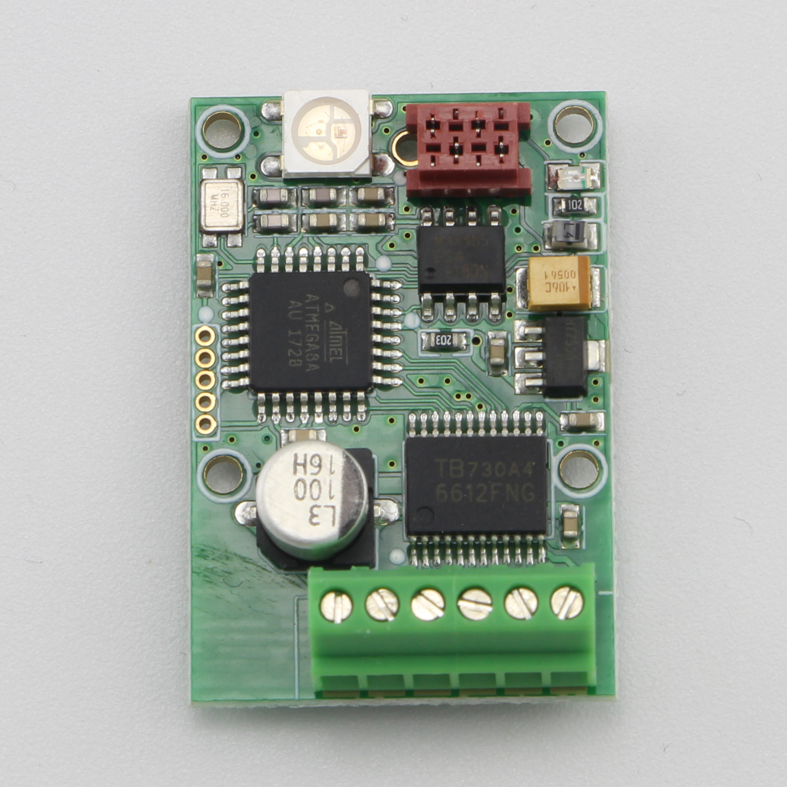

# SRB双电机节点

**SRB双电机节点**可以驱动两个电动机转动，使用H桥芯片实现正反转动，通过调整占空比实现开环调速。 
电机调速频率可以在1khz到20kHz之间调整，以适合不同的电机。
节点带有最小脉宽保护，可以在输入脉宽小于**最小脉宽**时不输出脉冲。
节点可以配置在总线停止发送信号后的行为，包括**保持之前的状态** ， **停止输出** 和 **刹车**
## 参数
- 逻辑供电，从SRB总线接入的电压
  - 电压最小值 5.5V
  - 20℃工作电压最大值 12.6V(电压大于12.6V需要加散热器)
  - 电压最大值 24V
  - 电流消耗 20mA
- 动力供电
  - 最小电压 2.5V
  - 最大电压 13.5V
- 电机驱动
  - H桥内阻 每个电机0.5Ω
  - 驱动电流 1.2A
  - 峰值电流 3.2A(小于10ms)
## 引脚说明
* A- 电机A负极
* A+ 电机A正极
* B- 电机B负极
* B+ 电机B正极
* V- 动力供电负极
* V+ 动力供电正极SRB
