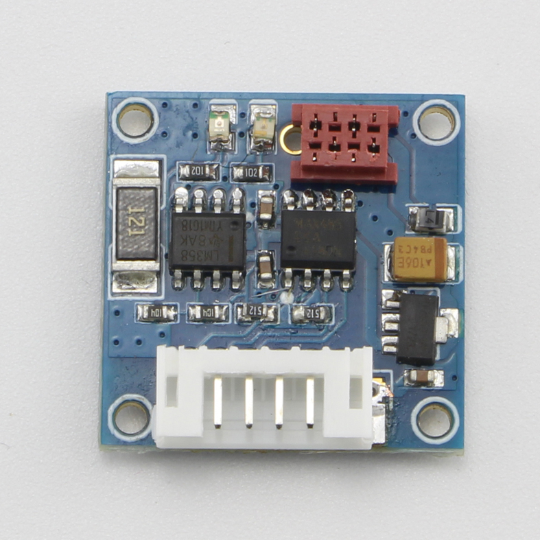
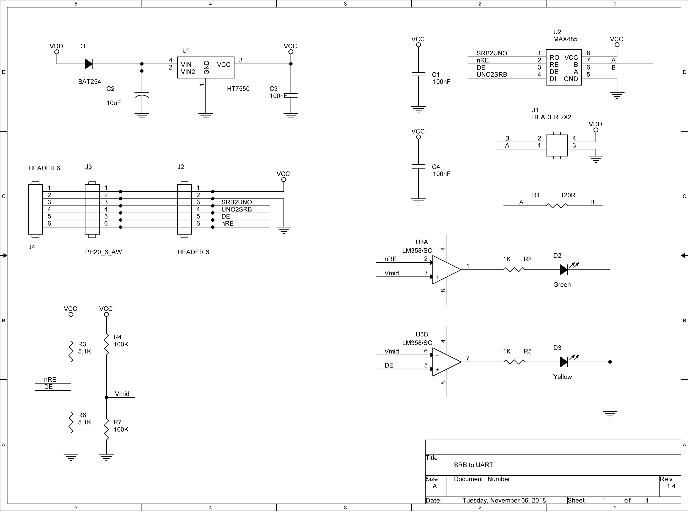

# SRBtoUart
 
** SRBtoUart** 可以连接Arduino或者其他开发板，让这些硬件接入SRB总线。 
 SRBtoUart需要连接开发板的Uart接口和1到2个GPIO。可以给外部的电路板提供5V供电。 

## 参数
- 逻辑供电，从SRB总线接入的电压
  - 电压最小值 5.5V
  - 20℃工作电压最大值 12.6V(电压大于12.6V需要加散热器)
  - 电压最大值 24V
  - 电流消耗 12mA + 对外供电电流
- 对外供电
  - 供电电压 5V
  - 最大电流 80mA
## 原理图

## 引脚说明
引脚 | 意义 | 说明
---|---|---
1  |VCC | 5V对外供电。可以给开发板或者Arduino供电，也可以不连接。
2  |GND   | 必须和开发板的GND，否则信电压没有参考。
3  |SRB2UNO |SRB总线收到的信号，应该连接开发板的Uart接收端。
4  |UNO2SRB |SRB调制器的输入端，应该连接开发板的Uart发送端。
5  |DE  |发送数据使能，高电平有效。DE使能后，UNO2SRB的数据将反应在总线上。
6  |nRE |接收总线数据使能，低电平有效。nRE使能后，总线上的数据将被采集到 SRB2UNO。

#### DE和nRE的使用说明
DE和nRE用于控制总线的使用，通常，DE和nRE的电平都为高时，总线进行发送；都为低时，总线进行接收。
因此对于一般设备，DE和nRE可以连接到一起使用。 
DE带有下拉电阻，nRE带有上拉电阻。如果将他们悬空，接收器和总线驱动都会被禁用。这时Uart端口不会和SRB连接，可以另做他用，例如发送调试信息或者通过串口下载程序DE和nRE可以选择BootLoader下为高阻态的端口。 
DE和nRE全部使能时发送的数据将被接收器收回。适用于需要CSMA-CA的情况。 
